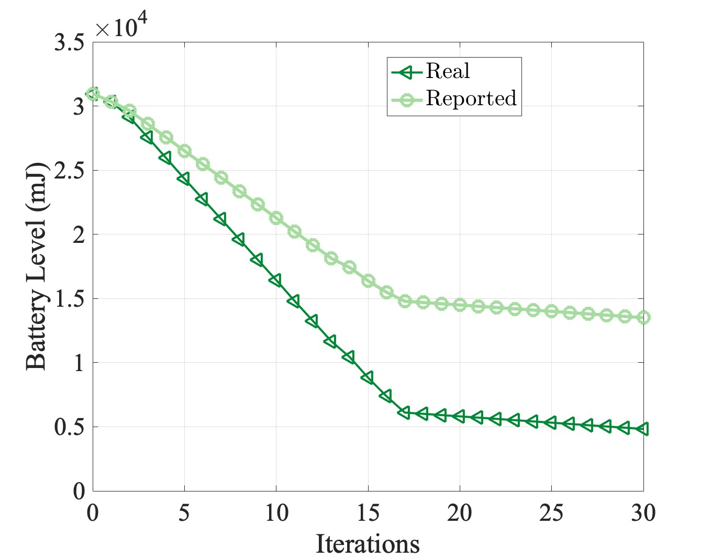
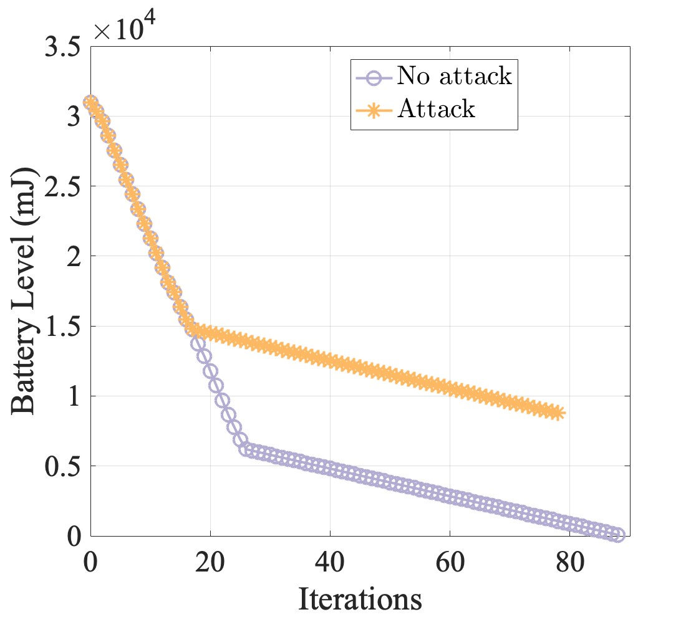
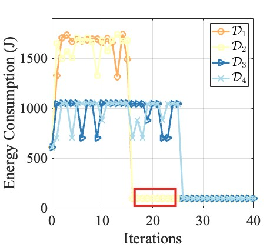

# Intent-driven Data Falsification Attack on Collaborative IoT-Edge Environments

This repository contains code and experimental artifacts related to the paper:

**Intent-driven Data Falsification Attack on Collaborative IoT-Edge Environments**

Shima Yousefi, Shameek Bhattacharjee, Saptarshi Debroy  
IEEE/ACM Symposium on Edge Computing (SEC), 2024

## Overview

Collaborative IoT-edge environments are widely used for hosting latency-sensitive AI applications. However, these systems are vulnerable to **data falsification attacks**, where compromised IoT devices misreport system parameters to manipulate resource allocation decisions.

This project investigates **intent-driven data falsification attacks** that target key system objectives such as:

- Energy efficiency
- Application latency
- System stability

## Attack Intents Studied

The paper studies four attacker intents:

1. Save energy (selfish intent)
2. Drain non-compromised devices
3. Jeopardize task deadlines
4. Operational impairment

## System Model

The experiments simulate a collaborative IoT-edge environment consisting of:

- camera-enabled drones
- edge server controller
- task offloading framework
- energy monitoring and reporting

## Experimental Setup

The attack model is evaluated using **testbed-in-the-loop simulations** involving:

- NVIDIA Jetson TX2 devices as IoT nodes
- Edge server controller
- simulated drone energy models
## Paper

Intent-driven Data Falsification Attack on Collaborative IoT-Edge Environments  
IEEE/ACM Symposium on Edge Computing (SEC), 2024

Paper link: https://ieeexplore.ieee.org/abstract/document/10818017

## Repository Structure
simulation/
attack-model/
experiments/
results/
figures/
## Experimental Results

### Drone Energy Behavior Under Selfish Intent Attack

(a) Real vs reported battery level for the compromised drone

(b) Battery level comparison under attack vs no attack

(c) Battery drain comparison for compromised vs non-compromised drone

(d) Energy consumption of drones during attack

### Break-even Time vs Attack Intensity (Fig. 4)

The figure below shows the break-even time of the attack as a function of the attack intensity (Δavg).  
As the falsified energy deviation increases, the attacker reaches the break-even point faster.

---

### Impact of Attack on System Behavior (Fig. 6)

The following result illustrates how falsified energy reports influence the behavior of the collaborative IoT-edge system.

## Citation

If you use this work, please cite:

Yousefi, S., Bhattacharjee, S., Debroy, S.  
Intent-driven Data Falsification Attack on Collaborative IoT-Edge Environments  
IEEE/ACM SEC 2024.
